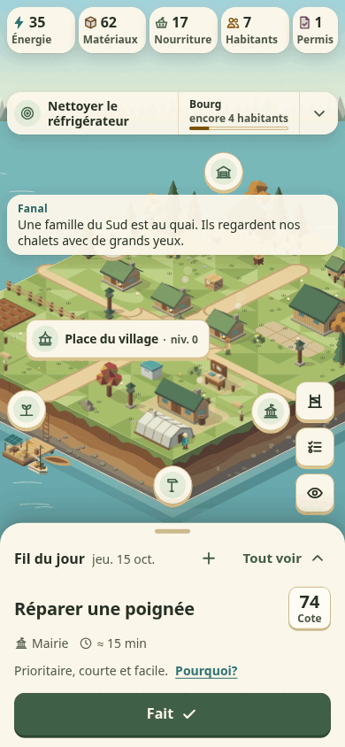
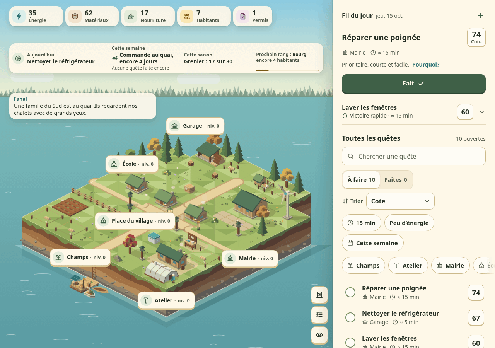

# La lisière rallumée

Une liste de tâches du foyer qui fait vivre un village. Chaque quête terminée rapporte de l’Énergie, des Matériaux ou de la Nourriture, et sert à bâtir un petit village du Nord : des chalets, une serre, une éolienne, un quai où passent des visiteurs. Des habitants arrivent, les saisons passent, l’hiver apporte ses tempêtes.

Le jeu est pensé pour une personne qui gère les tâches d’une maison, surtout sur téléphone ou tablette. Il s’installe sur l’écran d’accueil comme une application. Les imprévus du jeu restent dans le jeu : ils ne touchent jamais une vraie tâche.

<p>
  
  
</p>

*Captures faites avec les quêtes d’exemple de `tasks.example.json`.*

## Ce qu’il faut pour l’héberger

- Un hébergement web avec PHP 8.3 (la version sur laquelle le jeu est testé) et Apache ou LiteSpeed, qui lisent les fichiers `.htaccess`.
- Aucune base de données : tout est gardé dans des fichiers JSON.
- HTTPS, pour installer le jeu sur l’écran d’accueil.

Le jeu enregistre tout par un petit serveur en PHP (`app/api/api.php`). Un hébergement qui ne sert que des fichiers, Cloudflare Pages par exemple, ne suffit donc pas.

**Pour installer le jeu chez toi, suis le guide : [docs/INSTALLATION.md](docs/INSTALLATION.md).**

## L’essayer sur ton ordinateur

Il faut PHP 8.3. Depuis la racine du dépôt :

```bash
cp tasks.example.json tasks.json
php -S 127.0.0.1:8090 -t .
```

Puis ouvrir <http://127.0.0.1:8090/app/>. Avec ce serveur de développement, aucun code d’accès n’est demandé. La partie est gardée dans `app/api/data/`, ignoré par Git.

## Tests

Avec Node 24 et PHP 8.3 :

```bash
node --test "app/tests/core/*.test.mjs" "app/tests/api/*.test.mjs"
```

Les scénarios navigateur (`app/tests/e2e/`, lancés par `run-ui.sh`) utilisent la bibliothèque Playwright et prennent environ 45 minutes.

## Les dossiers

| Où | Quoi |
|---|---|
| `app/` | Le jeu. HTML, CSS et modules JavaScript, sans outil de construction ni dépendance. |
| `app/core/` | Les règles du jeu, en logique pure, testée. |
| `app/js/`, `app/world/` | L’interface et l’île. |
| `app/content/fr-CA/` | Tous les textes du jeu. |
| `app/api/` | Le serveur PHP et son modèle de réglages, `config.example.php`. |
| `app/ARCHITECTURE.md`, `app/DESIGN.md` | Le fonctionnement technique et le design. |
| `PRODUCT.md`, `docs/BIBLE-JEU.md` | Le cahier des charges, le récit et l’économie du jeu. |
| `docs/revue-2026-10/` | La revue d’octobre 2026 d’où vient le jeu actuel. |
| `tasks/` | Le journal de développement : le plan, lot par lot, et les leçons. |
| `tasks.example.json` | Des tâches fictives pour essayer. |
| `sync-tasks-remote.sh`, `TASKS_WORKFLOW.md`, `.hermes/` | La synchronisation avec Hermes, l’agent familial de l’installation d’origine. Inutile pour une autre installation. |
| `CLAUDE.md` | Les consignes des agents de code qui travaillent sur le dépôt. |

L’ancienne application et les maquettes qui ont précédé le jeu ne sont plus dans la branche principale. On les retrouve dans l’étiquette `v2.10.1` : `git checkout v2.10.1`.

## Licence

[PolyForm Noncommercial 1.0.0](LICENSE.md), Copyright 2026 Alexandre Alves.

Tu peux utiliser le jeu, le modifier et le partager pour tout usage non commercial. L’usage commercial n’est pas permis. Une copie doit garder le texte de la licence et sa ligne `Required Notice`. Le texte qui fait foi est celui de `LICENSE.md`, en anglais.
